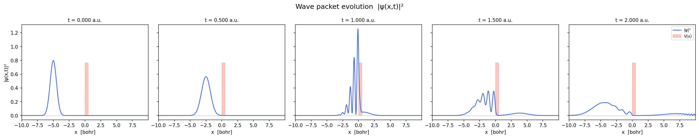
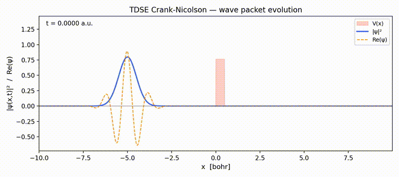
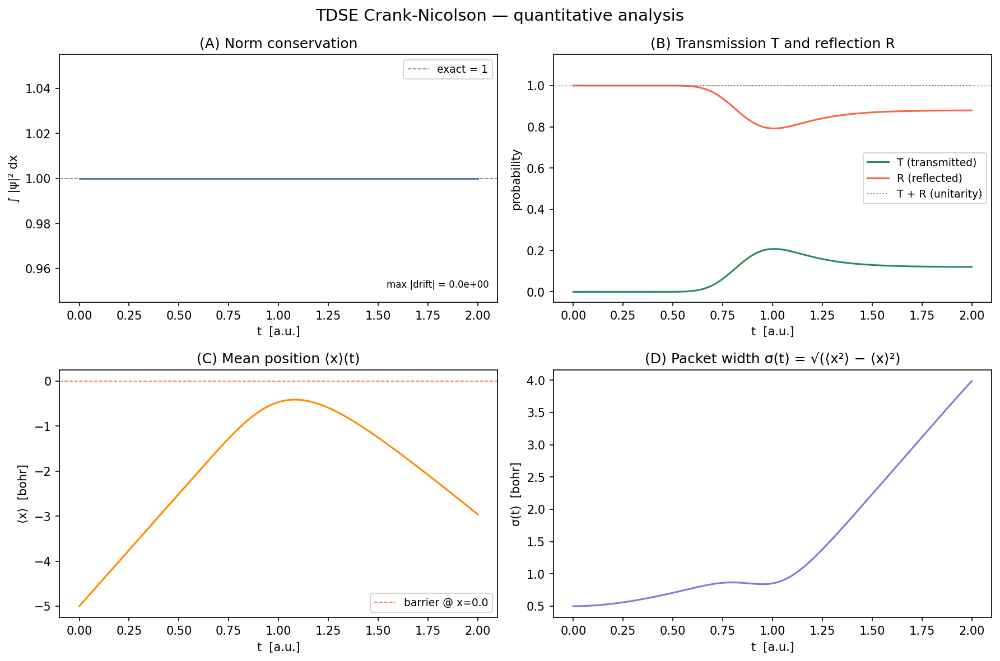

# TDSE Crank-Nicolson solver

Numerical solution of the **time-dependent Schrödinger equation** (TDSE) in one spatial dimension using the **Crank-Nicolson implicit scheme**.
All quantities are in **atomic units**: ℏ = m = 1.

For build instructions, usage, and parameter guidance see [setup_guide.md](setup_guide.md).

---

## Physics

### The problem

The TDSE describes how a quantum state ψ(x, t) evolves in time under a potential V(x):

```
        ∂ψ        1  ∂²ψ
  i ℏ ──── = − ─── ──── + V(x) ψ
        ∂t        2m ∂x²
```

In atomic units (ℏ = m = 1) this simplifies to:

```
  ∂ψ      1 ∂²ψ
 i── = − ─ ──── + V(x) ψ  =  H ψ
  ∂t      2 ∂x²
```

The initial state is a **Gaussian wave packet** centred at x₀ with width σ and mean momentum k₀:

```
  ψ(x, 0)  ∝  exp[ −(x−x₀)² / 4σ² ]  ·  exp( i k₀ x )
```

The envelope is a Gaussian (localised particle); the plane-wave factor gives it a definite mean momentum p = ℏk₀.
The packet is normalised so that ∫ |ψ|² dx = 1 (total probability = 1).

The potential is a **rectangular barrier** of height V₀ and width w, centred at x_bar.
When the packet reaches the barrier, quantum mechanics predicts two effects:

- **Reflection**: part of the wave function bounces back.
- **Tunnelling**: even if the kinetic energy E = k₀²/2 is less than V₀, part of the wave function leaks through the barrier. This has no classical analogue.

The relative probabilities are characterised by the **transmission coefficient T** and the **reflection coefficient R**, with T + R = 1 (probability is conserved).

### The Crank-Nicolson scheme

The TDSE is discretised on a uniform grid with spacing dx and time step dt.
The spatial derivative is approximated with the standard second-order finite difference:

```
  ∂²ψ     ψ[i−1] − 2ψ[i] + ψ[i+1]
  ──── ≈  ─────────────────────────
  ∂x²                dx²
```

The time update uses the **Crank-Nicolson** formula, which averages the Hamiltonian between the current (n) and the next (n+1) time level:

```
  ψⁿ⁺¹ − ψⁿ       H (ψⁿ⁺¹ + ψⁿ)
  ────────────  =  ──────────────
       dt                2i
```

Rearranging, this becomes a **tridiagonal linear system** at each time step:

```
  A · ψⁿ⁺¹ = B · ψⁿ
```

where A = I + (i dt/2) H and B = I − (i dt/2) H are complex tridiagonal matrices.
Because A and B do not depend on time (V is static), they are built once and reused.

Key properties of the Crank-Nicolson scheme:

| Property | Value |
|---|---|
| Time accuracy | 2nd order in dt |
| Space accuracy | 2nd order in dx |
| Stability | unconditionally stable (unitary propagator) |
| Norm conservation | exact (up to floating-point rounding) |

### Linear solver: Thomas algorithm

The tridiagonal system A · ψⁿ⁺¹ = rhs is solved at each step with the **Thomas algorithm** (tridiagonal matrix algorithm, TDMA): a specialised form of Gaussian elimination that runs in O(N) operations.
This is the same technique used by LAPACK's `zgtsv`, implemented here explicitly in complex arithmetic.

### Boundary conditions

**Dirichlet**: ψ(x_min, t) = ψ(x_max, t) = 0.
The domain is chosen large enough that the wave packet does not reach the boundaries during the simulation, so the walls act as perfect reflectors without distorting the physics.

---

## Results

### Wave packet evolution

The wave packet starts localised on the left, travels toward the rectangular barrier, and partially reflects and tunnels through it.



### Full time evolution (animation)



### Quantitative analysis

The four panels show: (A) norm conservation ∫|ψ|² dx ≈ 1 throughout; (B) transmission T and reflection R coefficients; (C) mean position ⟨x⟩(t); (D) wave packet width σ(t).



---

## Project structure

```
TDSE_CN/
├── input/
│   └── input.txt          # simulation parameters
├── src/
│   ├── params.hpp / .cpp  # parameter struct, file reader, printer
│   ├── physics.hpp / .cpp # grid, potential, wave packet, CN matrices
│   └── tdse.cpp           # main: time loop, Thomas solver, file I/O
├── output/                # generated at build time (gitignored)
│   ├── psi_000000.csv     # snapshots: x, |ψ|², Re(ψ), Im(ψ), V
│   ├── ...
│   └── norm.csv           # t, norm² at every snapshot
├── analysis/
│   ├── plot_snapshots.py  # 5-panel static figure of |ψ|² evolution
│   ├── plot_animation.py  # MP4/GIF animation of the full evolution
│   └── plot_analysis.py   # norm, T/R, ⟨x⟩, σ quantitative plots
├── README.md
└── setup_guide.md
```
